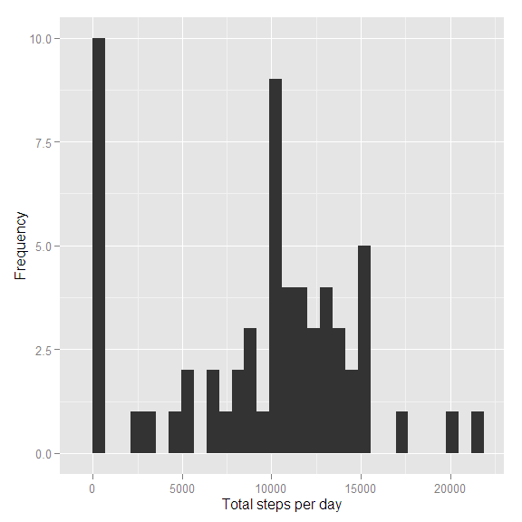
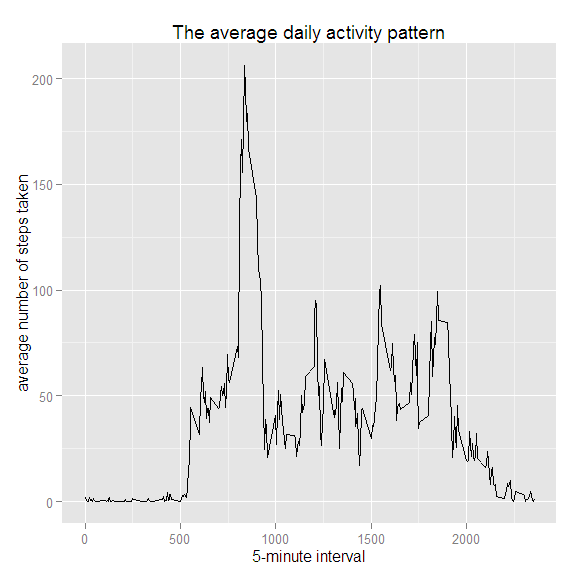
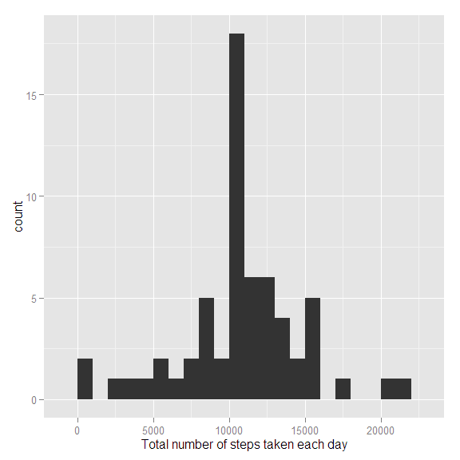
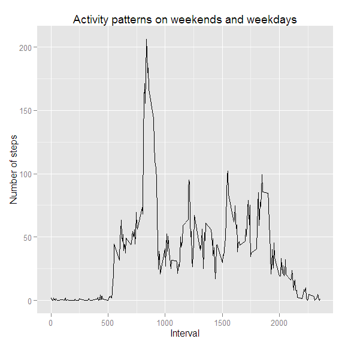
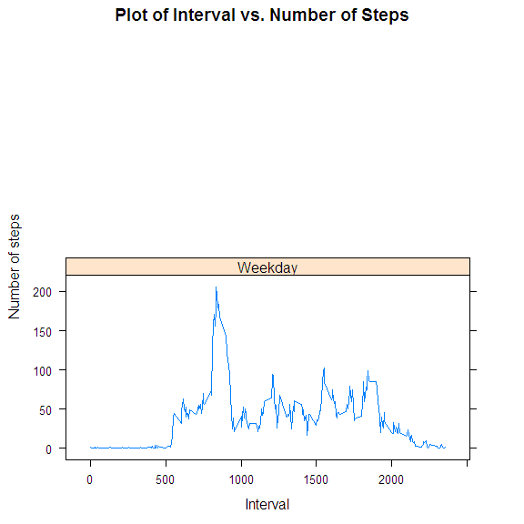

Reproducible Research: Peer Assessment 1
============================================
+   output: 
+   html_document:
+   keep_md: true

Loading the required packages


```r
library(knitr)
library(ggplot2)
library(plyr)
library(lattice)
```

Global knitr setup

```r
require(knitr)
opts_chunk$set(message=FALSE, fig.width = 6, fig.height = 6)
```


## Loading and preprocessing the data

###1. Load the data (i.e. read.csv())
Download the file and put in the 'data' folder:

```r
if(!file.exists("./data")){dir.create("./data")}
fileUrl <- "https://d396qusza40orc.cloudfront.net/repdata%2Fdata%2Factivity.zip" 
download.file(fileUrl, destfile = "./data/activity.zip")
```
Unzip the file:

```r
unzip(zipfile = "./data/activity.zip", exdir = "./data")
```
Read the data:

```r
if(!exists("activity")){
        activity <- read.csv("./data/activity.csv")
}
```

###2.Process/transform the data (if necessary) into a format suitable for your analysis 
Making sure date field contains date by transforming string to date format:

```r
activity <- transform(activity, date = as.Date(date))
```


## What is mean total number of steps taken per day?
Creating a subset of the steps per day

```r
StepsPerDay <- tapply(activity$steps, activity$date, FUN = sum, na.rm = TRUE)
```
###1. Make a histogram of the total number of steps taken each day

```r
qplot(StepsPerDay, xlab='Total steps per day', ylab='Frequency')
```

 

###2. Calculate and report the mean and median total number of steps taken per day

```r
StepsPerDayMean <- mean(StepsPerDay)
StepsPerdayMedian <- median(StepsPerDay)
```

* Mean: 9354.2295082
* Median: 10395


## What is the average daily activity pattern?

```r
averages <- aggregate(x = list(steps = activity$steps), 
                      by = list(interval = activity$interval),
                      FUN = mean, 
                      na.rm = TRUE)
```
###1. Make a time series plot (i.e. type = "l") of the 5-minute interval (x-axis) and the average number of steps taken, averaged across all days (y-axis)

```r
p <- ggplot(data = averages, aes(x = interval, y = steps)) 
p <- p + geom_line()
p <- p + ggtitle("The average daily activity pattern")
p <- p + xlab("5-minute interval")
p <- p + ylab("average number of steps taken")
print(p)
```

 

###2. Which 5-minute interval, on average across all the days in the dataset, contains the maximum number of steps?

```r
MaxSteps <- averages[which.max(averages$steps),]
```

- The 5-minute interval, on average across all days, that contains the maximum number of steps is 835


## Imputing missing values

###1. Calculate and report the total number of missing values in the dataset (i.e. the total number of rows with NAs)

```r
MissingValues <- sum(is.na(activity$steps))
```

* Totoal number of missing values: 2304

###2. Devise a strategy for filling in all of the missing values in the dataset. The strategy does not need to be sophisticated. For example, you could use the mean/median for that day, or the mean for that 5-minute interval, etc.

```r
MissingReplace <- function(act) {
        ddply(act, ~interval, function(dd) {
                steps <- dd$steps
                dd$steps[is.na(steps)] <- mean(steps, na.rm = TRUE)
                return(dd)
        })
}
```
###3. Create a new dataset that is equal to the original dataset but with the missing data filled in.

```r
CompletedActivity <- MissingReplace(activity)
```
###4. Make a histogram of the total number of steps taken each day and Calculate and report the mean and median total number of steps taken per day. Do these values differ from the estimates from the first part of the assignment? What is the impact of imputing missing data on the estimates of the total daily number of steps?

Number of steps taken each day

```r
TotalSteps <- tapply(CompletedActivity$steps, CompletedActivity$date, FUN = sum)
```

Creating a histogram

```r
qplot(TotalSteps, binwidth = 1000, xlab = "Total number of steps taken each day")
```

 

```r
mean(TotalSteps)
```

```
## [1] 10766.19
```

```r
median(TotalSteps)
```

```
## [1] 10766.19
```


## Are there differences in activity patterns between weekdays and weekends?

###1. Create a new factor variable in the dataset with two levels -- "weekday" and "weekend" indicating whether a given date is a weekday or weekend day.

```r
WeekLevel <- c("Weekday", "Weekend")
DateToWeekLevel <- function(date) {
    day <- weekdays(date)
    part <- factor("Weekday", WeekLevel)
    if (day %in% c("Saturday", "Sunday"))
        part <- factor("Weekend", WeekLevel)
    return(part)
}

CompletedActivity$WeekLevel <- sapply(CompletedActivity$date, DateToWeekLevel)
```

###2. Make a panel plot containing a time series plot (i.e. type = "l") of the 5-minute interval (x-axis) and the average number of steps taken, averaged across all weekday days or weekend days (y-axis). The plot should look something like the following, which was created using simulated data:


```r
AverageSteps <- ddply(CompletedActivity,
                  .(interval, WeekLevel),
                  summarise,
                  #mean = mean(steps))
                  steps = mean(steps))

q <- ggplot(AverageSteps, aes(x = interval, y = mean))
q <- p + geom_line() + facet_grid(. ~ WeekLevel, )
q <- p + ggtitle("Activity patterns on weekends and weekdays")
q + xlab("Interval") + ylab("Number of steps")
```

 

```r
#Lattice plot

xyplot((steps) ~ interval | WeekLevel, 
       data = AverageSteps,
       main = "Plot of Interval vs. Number of Steps", 
       type = "l", 
       xlab = "Interval",
       ylab = "Number of steps",
       layout=c(1,2))
```

 

